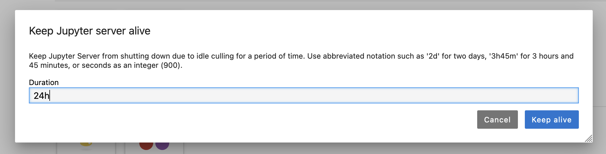
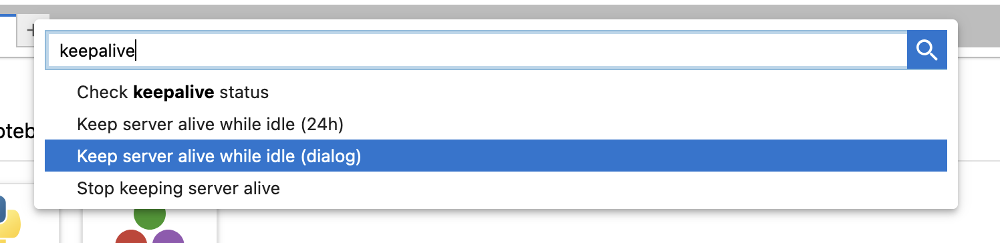

# jupyter-keepalive

[](https://pypi.org/project/jupyter-keepalive)
[](https://pypi.org/project/jupyter-keepalive)

A JupyterLab extension to help keep your Jupyter Server from being culled due to idleness.




## Installation

```console
pip install jupyter-keepalive
```

## How to Use

Currently, you have to use the JupyterLab Command Palette to use `jupyter-keepalive`. `View -> Activate Command Palette`
or `Command+Shift+C` (on Mac) or `Control+Shift+C` (on Linux/Windows) will open the command palette. Searching for
"keepalive" should show you the following 4 options:



"Keep server alive while idle (24h)" keeps the server alive for the next 24h.

"Keep server alive while idle (dialog)" opens the following dialog box that allows you to specify how long
you want your server to be kept open regardless of activity.


"Stop keeping server alive" stops the keepalive functionality, and lets the idle culler do its job.

"Check keepalive status" refreshes the keepalive status, which is displayed in the statusbar at the bottom
when keepalive is active. No status bar item is present when keepalive is inactive.


## Future work

Future work will enable easier UI for accessing the functionality of jupyter-keepalive so the
command pallette is not needed.

## License

`jupyter-keepalive` is distributed under the terms of the [BSD 3-Clause](https://spdx.org/licenses/BSD-3-Clause.html) license.
